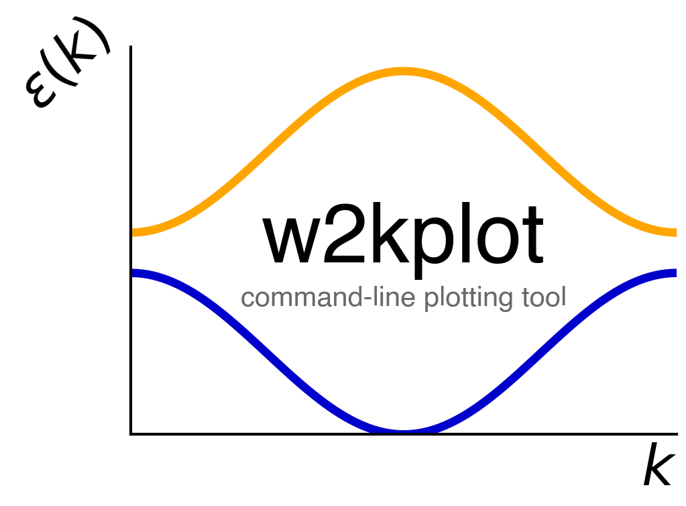

<p align="center">
<a href="https://github.com/harrisonlabollita/w2kplot">

</a>
</p>

**w2kplot** is a Python program to create publication quality band structure plots from [Wien2k](http://susi.theochem.tuwien.ac.at) density-functional theory (DFT) calculations. The user simply runs the program inside the directory with the required files from Wien2k and it takes care of the rest! 

**This program works! But it is still in beta. See below**

## Example
Inside a directory with files: case.bands.agr and case.spaghetti\_ene (minimal files), simply type

```bash
	w2kplot --switch bands
```
This will plot the E(k) vs the high-symmetry k-path detected from the case.klist\_band. The user can provide this information as well. Spin-polarized cases work similarily just add ``--spin join or sep``, where ``join`` will plot spin channels on top of each other and ``sep`` will plot spin channels separately.


For fatbands,

```bash
	w2kplot --init --switch fatbands
```
The init flag creates the ``w2kplot.init`` file which tells the progam which atom and orbitals you would like to plot the fatbands for. To use this feature, you must provide the case.qtl (for orbital content), case.struct (to create init file), and case.scf (to grab the Fermi energy).


**TO-DO**
- [ ] **it would be helpful if there was a library associated with this package such that one could write something like the following**
This would be the most helpful thing to implement at the moment! High priority on the todo list.
	-``from spaghetti import band_plot; band_plot("filename", **kwargs); plt.show()``
- [ ] complete Fermi surface slices program
	- generate klistband file
        - create a job.sh file to run wien2k
	- program to plot the resulting Fermi surface slice
- [ ] register package with pypy

**PRs and feedback are welcome!**

## Installation

Currently, if you clone this repository and inside the repo issue the command you should be good to go!

```bash
    pip install -e .
```
