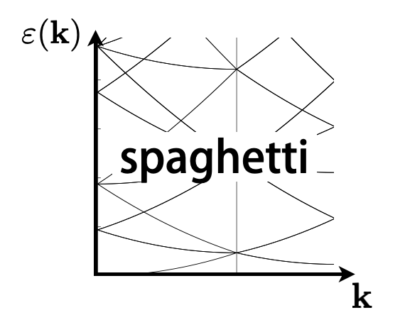

A plotting library written in python to plot band structures (including band character) and density of states from commercial DFT codes: VASP and Wien2k.

Scripts in `src` work, but interface is to come later.
