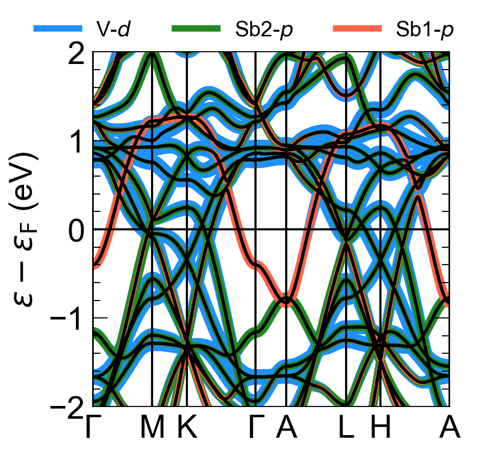
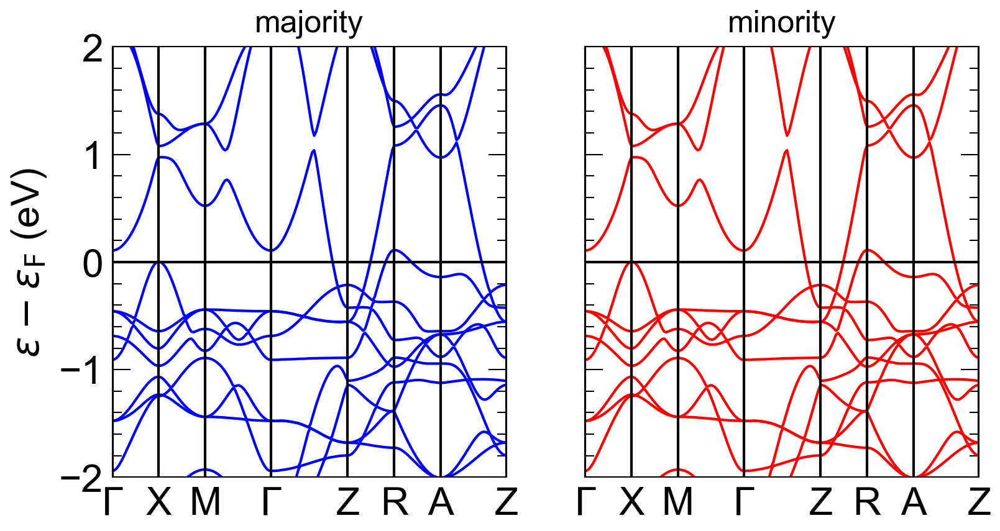

Examples
========

We provide two example scripts to showcase some the functionality behind w2kplot.

## Orbital character plotting

The script [fatband.py](csv3sb5/fatband.py) plots the band structure of the kagome material CsV₃Sb₅ with orbital character for the V-d and Sb-p orbitals.
```python
import matplotlib.pyplot as plt
from w2kplot import *

dft = FatBands(atoms=[2,4,3],                 # 2 = V, 3=Sb1, 4=Sb2 (see struct file)
              orbitals=[[7],[3],[3]], # 7=d, 3=p, 3=p (see header of qtl file)
              colors=[['dodgerblue'],['forestgreen'],['tomato']],
              weight  = 50)

fig, ax = plt.subplots()
ax.fatband_plot(dft, "k-", lw=1.5)
fig.legend(handles=dft.create_legend(), ncol=3, loc="upper center")
plt.savefig('plot.png', dpi=300)
```



## Spin-polarized

We can plot spin-polarized cases with easy by just creating two `Band` objects and then plotting them on a subplot grid. For example, we provide the [spin.py](la11sp/spin.py) script,

```python
import matplotlib.pyplot as plt
from w2kplot import *


fig, ax = plt.subplots(1,2,sharey=True)

up_channel=Bands(spaghetti="la112sp.spaghettiup_ene")
dn_channel=Bands(spaghetti="la112sp.spaghettidn_ene")
ax[0].band_plot(up_channel, "b-", lw=1); ax[0].set_title('majority')
ax[1].band_plot(dn_channel, "r-", lw=1); ax[1].set_title('minority')
ax[1].set_ylabel("") # remove the y-label from this subplot

plt.subplots_adjust(hspace=0.05)
plt.savefig('plot.png', dpi=300)
```


